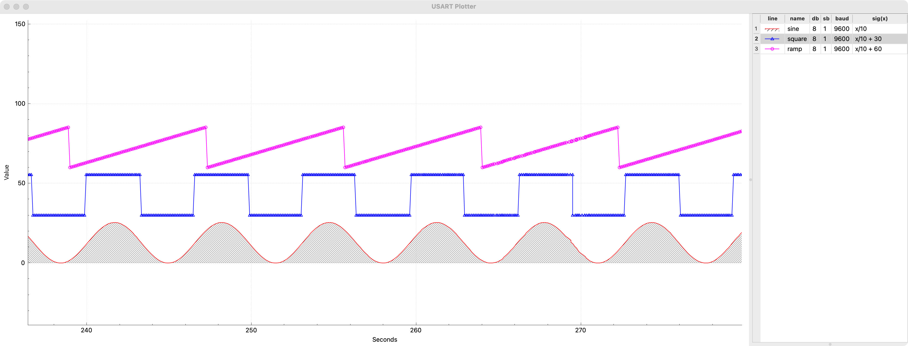
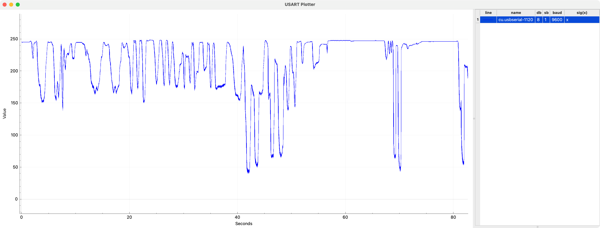

# uplt

Universal synchronous/asynchronous receiver/transmitter plotter

## What it has/can do
 * [x] Serial port multiplexer
 * [x] Graph apperance editor
 * [x] Hiding individual graphs
 * [x] Data exporting
 * [x] Port alias semantic
 * [x] Graph following
 * [x] Antialiasing
 * [x] Plot exporting (as .png)

## Imagery



Last image is a [ACD input from a light dependent
resistor](https://github.com/Dolfost/avr-learning/tree/main/avr/ldr_plotter)
hooked up over USART:

```c
#include "pins.h"

#include <avr/io.h>
#include <util/delay.h>

#include <avrtools/usart.h>

static inline void init_ADC0(void) {
    ADMUX |= (1 << REFS0);
    ADCSRA |= (1 << ADPS2);
    ADCSRA |= (1 << ADEN);
    ADMUX |= (1 << ADLAR);
}

int main(void) {
    uint8_t ldr_voltage;
    init_ADC0();
    usart_init();

    ADCSRA |= (1 << ADSC);
    loop_until_bit_is_clear(ADCSRA, ADSC);
    ldr_voltage = ADCH;
    usart_transmit_byte(ldr_voltage);
    while (1) {
        ADCSRA |= (1 << ADSC);
        loop_until_bit_is_clear(ADCSRA, ADSC);
        _delay_ms(10);
        ldr_voltage = ADCH;
        usart_transmit_byte(ldr_voltage);
    }
    return 0;
}
```

<p align="center">
  
  
</p>
